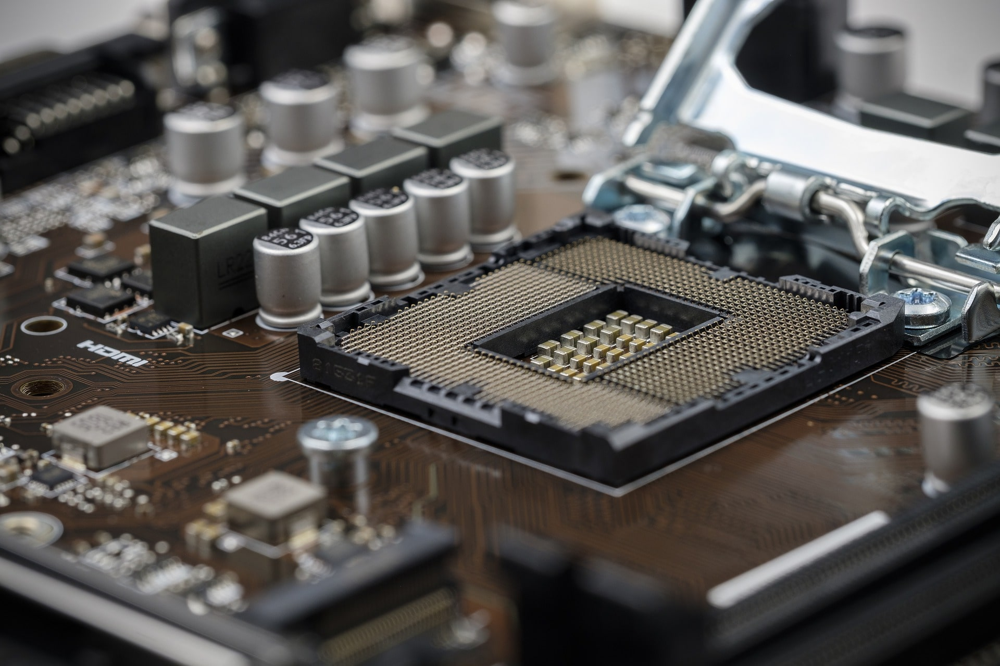
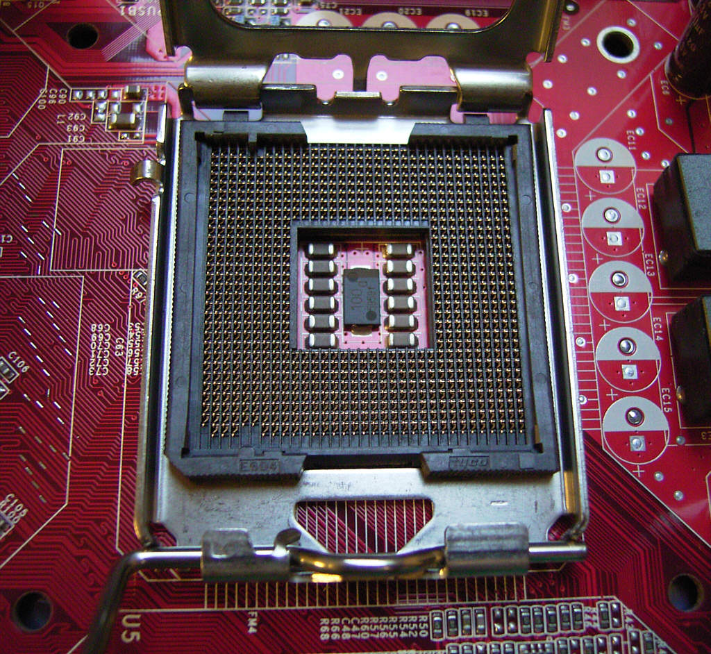
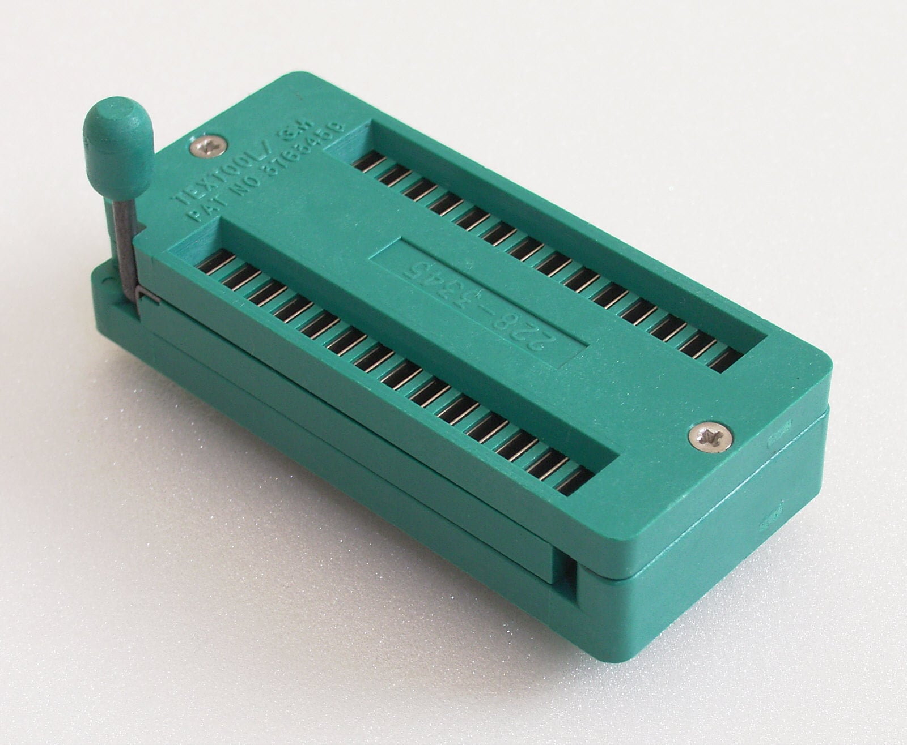

<!--
  ~ Copyright (c) 2022 Tobias Briones. All rights reserved.
  ~ SPDX-License-Identifier: CC-BY-SA-4.0
  ~
  ~ This source code is part of
  ~ https://github.com/tobiasbriones/cp-unah-is911-microprocessors and is
  ~ licensed under the Creative Commons Attribution Share Alike 4.0
  ~ International License found in the LICENSE file in the root
  ~ directory of this source tree or at https://spdx.org/licenses/CC-BY-SA-4.0
  -->

# Modern CPU Sockets

This research framework provides a summary of existing modern PC sockets in
2022.

## Introduction

Sockets are connectors that allow physical and electrical connectivity from the
microprocessor to the motherboard. They are also known as "slots".

As mentioned above, we can make the following statement about sockets:

> A **CPU socket** or **CPU slot** contains one or more mechanical
> components providing mechanical and electrical connections between a
> microprocessor and a printed circuit board (PCB). This allows for placing and
> replacing the central processing unit (CPU) without soldering.
>
> Source: *Wikipedia* \| CPU socket [11] (under CC-BY-SA-3.0)

To list some types of sockets, we have [1]: TR4, AM4, LGA 1151, 2066, sTRX4.
When designing a configuration for a PC, it must be taken into account that the
motherboard is compatible with the rest of the chosen hardware and, in
particular, that the socket is the one that corresponds to the model of the CPU
that must be installed.

### Definition

A simple definition of a socket is:

> The socket refers to a physical connector on a computer motherboard that
> accepts a single physical chip. Many motherboards can have multiple sockets 
> that can in turn accept multi-core chips.
> 
> Source: *University Information Technology Services* \| About processors, 
> chips, sockets, and cores [6] (under fair use)

Personal computers (including gaming PCs) and industrial computers have similar
or the same sockets. These sockets are mostly found on these computers, unlike
mobile devices like laptops or smartphones, which bring the CPU soldered on the
motherboard or have a SoC (System on a Chip), an integrated circuit that
implements the CPU, memory, and others' components on a single chip.

<figcaption>

<strong>CPU Socket</strong>

Source: Image by Bruno /Germany Pixabay [2]

</figcaption>

## Socket Types

According to current data, the types of sockets that are currently used for
personal computers, gaming and even workstation or industrial / servers will be
shown next.

There is a large number of old sockets, only the most recent will be detailed.

For desktop PC there are the following models:

| Socket Name               | Introduction Year | CPUs                                                      | Package | Pins |
|---------------------------|-------------------|-----------------------------------------------------------|---------|------|
| Socket AM5                | 2022              | AMD Zen 4                                                 | LGA     | 1718 |
| LGA 1700                  | 2021              | Intel Alder Lake                                          | LGA     | 1700 |
| LGA 1200                  | 2020              | Intel Comet Lake Intel Rocket Lake                        | LGA     | 1200 |
| Socket sTRX4/Socket SP3r3 | 2019              | AMD Ryzen Threadripper (series 3, 000)                    | LGA     | 4094 |
| LGA 2066/Socket R4        | 2017              | Intel Skylake-X Intel Kaby Lake-X Intel Cascade Lake-X    | LGA     | 2066 |
| Socket TR4/Socket SP3r2   | 2017              | AMD Ryzen Threadripper                                    | LGA     | 4094 |
| Socket AM4                | 2017              | AMD Ryzen 9AMD Ryzen 7 AMD Ryzen 5 AMD Ryzen 3 Athlon 200 | PGA     | 1331 |

<figcaption>

<strong>Recent CPU Sockets</strong>

Source: <it>Wikipedia</it> \| CPU Socket [11]

</figcaption>

Computers can be classified into conventional (PC or personal computer), HEDT 
(High-End Desktop are High-Performance PCs), or Servers/Industrial/WorkStations.
The sockets listed here are for conventional desktop PCs with very popular CPUs,
and some of them are high-performance CPUs like the AMD Ryzen Threadripper, and
Intel Core X (LGA 2066/Socket R4). These are examples of desktop and server
models as well.

Among the mentioned models above and other popular ones, a resume with the
following more-practical information is displayed next, including the CPU model(
s), generation, compatible chipsets, and type of personal computer:

- **Intel LGA 2066:** 10ma Gen., X299, HEDT.
- **Intel LGA 1200:** 11/10ma Gen., Z490/H470, B460, H410, Convencional.
- **Intel LGA 1151:** 9/8va Gen., Z390/Z370/Z370/Q370/H370/B365/B360/H310,
  Convencional.
- **AMD sTRX4:** Ryzen Threadripper 3000, TRX40, HEDT.
- **AMD TR4:** Ryzen Threadripper 2000 y 1000, x399, HEDT.
- **AMD AM4:** Ryzen 5000, 3000, 2000 y 1000,
  X570/X470/X370/B550/B450/B350/B450/A320/X300/A300, Convencional.

<figcaption>

<strong>List of modern CPU sockets</strong>

Source: <it>tom'sHARDWARE</it> [4]

</figcaption>

## Functioning

The mechanism of functioning is defined according to the socket package. As
mentioned, the operation of a socket is such that it allows the physical
connection of the microprocessor to the motherboard.

### Land Grid Array (LGA)

LGA sockets are the most populars since much today's PC CPU models employ 
this kind of socket.

According to *ONLOGIC Blog* [3], most modern removable CPUs use LGA sockets.

Their functioning consists of:

> The land grid array (LGA) is a type of surface-mount packaging for integrated
> circuits (ICs) that is notable for having the pins on the socket 
> (when a socket is used) rather than the integrated circuit.
> 
> LGA can be electrically connected to a printed circuit board (PCB) either by 
> the use of a socket or by soldering directly to the board.
> 
> The land grid array is a packaging technology with a rectangular grid of 
> contacts, 'lands', on the underside of a package. The contacts are to be 
> connected to a grid of contacts on the PCB. Not all rows and columns of the 
> grid need to be used.
> 
> Unlike the pin grid array (PGA) interface found on most AMD and older Intel 
> processors, there are no pins on the chip; in place of the pins are pads of 
> bare gold-plated copper that touch protruding pins on the microprocessor's 
> connector on the motherboard.
> 
> Source: *Wikipedia* \| Land grid array [10] (under CC-BY-SA-3.0)

<figcaption>

<strong>LGA Socket</strong>

Source: By User Smial on de.wikipedia - Own work, CC BY-SA 
2.0 de, https://commons.wikimedia.org/w/index.php?curid=1066500 [10]

</figcaption>

As can be seen, both major manufacturers, AMD and Intel use it for many of their
microprocessors. Note that, for example, Socket sTRX4 is actually an LGA 
4094 [10].

### Pin Grid Array (PGA)

Its functioning is as follows:

> A pin grid array (PGA) is a type of integrated circuit packaging. In a PGA,
> the package is square or rectangular, and the pins are arranged in a regular 
> array on the underside of the package.
> 
> PGAs are often mounted on printed circuit boards using the through hole method
> or inserted into a socket.
> 
> Source: *Wikipedia* \| Pin grid array [8] (under CC-BY-SA-3.0)

### Ball Grid Array (BGA)

Mostly used for mobile devices or for electrical engineering
[9] thus we don't care too much about it in this article. We have that:

> A ball grid array (BGA) is a type of surface-mount packaging (a chip carrier) 
> used for integrated circuits. BGA packages are used to permanently mount 
> devices such as microprocessors.
> 
> The BGA is descended from the pin grid array (PGA), which is a package with 
> one face covered (or partly covered) with pins in a grid pattern which, in 
> operation, conduct electrical signals between the integrated circuit and the 
> printed circuit board (PCB) on which it is placed. In a BGA the pins are 
> replaced by pads on the bottom of the package, each initially with a tiny 
> solder ball stuck to it.
> 
> Source: *Wikipedia* \| Ball grid array [9] (under CC-BY-SA-3.0)

### Zero Insertion Force (ZIF)

The ZIF socket allows to insert the IC pretty easy. For example, we have the 
PIC microcontroller's programmer where we insert the IC directly into the 
socket.

<figcaption>

<strong>ZIF Socket</strong>

Source: By User Smial on de.wikipedia - Own work, CC BY-SA 
2.0 de, https://commons.wikimedia.org/w/index.php?curid=1058788 [7]

</figcaption>

Its functioning consists of:

> Zero insertion force (ZIF) is a type of IC socket or electrical connector that
> requires very little force for insertion. With a ZIF socket, before the IC is 
> inserted, a lever or slider on the side of the socket is moved, pushing all 
> the sprung contacts apart so that the IC can be inserted with very little 
> force - generally the weight of the IC itself is sufficient and no external 
> downward force is required.
> 
> Source: *Wikipedia* \| Zero insertion force [7] (under CC-BY-SA-3.0)

Therefore, they are niche sockets, and we don't care about them eiter. 

## References

[1] Johnson, Q. (2020, June 22). Building Your Own PC: Part Picking – TechTalk.
TechTalk - Articles on the Latest Technology, on and off Campus. Retrieved
January 31, 2022,
from https://itblogs.semo.edu/2020/06/22/building-your-own-pc-part-picking.

[2] B.-O. (2019, August 8). Cpu Processor Chip - Free photo on Pixabay. Pixabay.
Retrieved January 31, 2022,
from https://pixabay.com/photos/cpu-processor-chip-motherboard-4393380.

[3] Fanton, D. (2021, November 10). What is a CPU socket for an industrial
computer? ONLOGIC Blog. Retrieved January 30, 2022,
from https://www.onlogic.com/company/io-hub/what-is-a-cpu-socket-for-an-industrial-computer.

[4] Harding, S. (2021, July 29). What Is a CPU Socket? A Basic Definition. Tom’s
Hardware. Retrieved January 30, 2022,
from https://www.tomshardware.com/reviews/cpu-socket-definition,5758.html.

[5] Knowledge, S. B.-W. (2020, April 9). What is the function of CPU socket? –
SidmartinBio. SidmartinBio - Wide Base of Knowledge. Retrieved January 31, 2022,
from https://www.sidmartinbio.org/what-is-the-function-of-cpu-socket.

[6] University Information Technology Services. (2019, February 15). About
processors, chips, sockets, and cores. The Trustees of Indiana University.
Retrieved January 30, 2022, from https://kb.iu.edu/d/avfb.

[7] Wikipedia contributors. (2021a, January 18). Zero insertion force.
Wikipedia. Retrieved January 31, 2022,
from https://en.wikipedia.org/wiki/Zero_insertion_force.

[8] Wikipedia contributors. (2021b, September 2). Pin grid array. Wikipedia.
Retrieved January 31, 2022, from https://en.wikipedia.org/wiki/Pin_grid_array.

[9] Wikipedia contributors. (2022a, March 11). Ball grid array. Wikipedia.
Retrieved January 31, 2022, from https://en.wikipedia.org/wiki/Ball_grid_array.

[10] Wikipedia contributors. (2022b, March 11). Land grid array. Wikipedia.
Retrieved January 31, 2022, from https://en.wikipedia.org/wiki/Land_grid_array.

[11] Wikipedia contributors. (2022c, March 21). CPU socket. Wikipedia. Retrieved
January 30, 2022, from https://en.wikipedia.org/wiki/CPU_socket.
